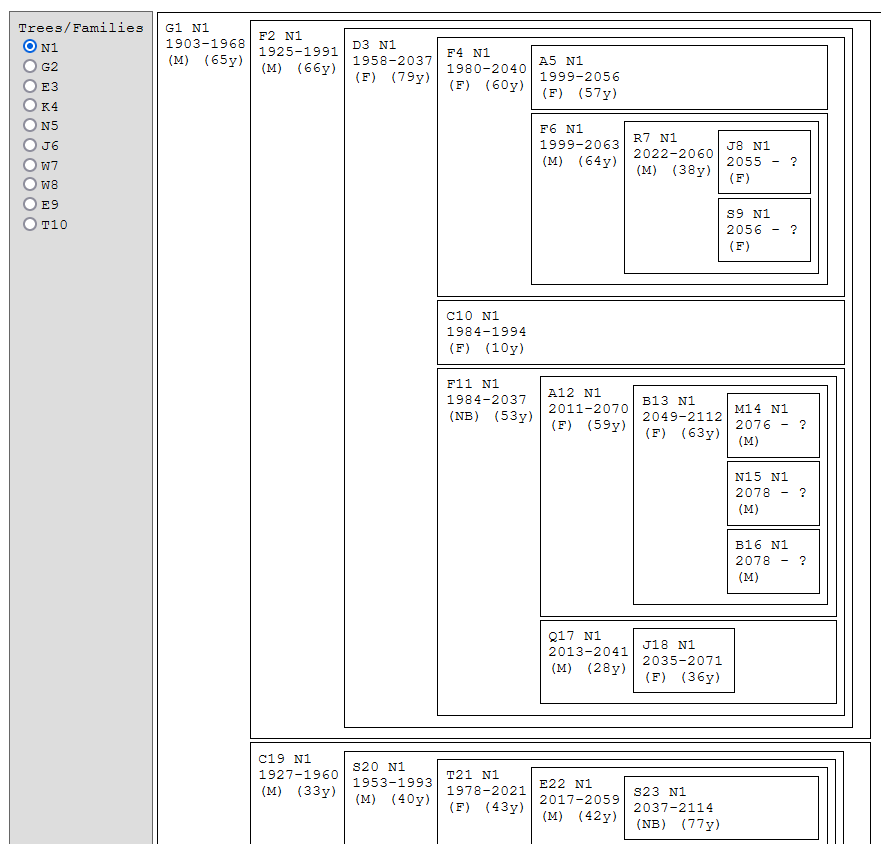

# Generate Family Trees

Tool for auto-generating a few interconnected family trees, for fiction writing.

This is a story-building device, so it's loose on the details.

# Sample Output

# How To

Download the HTML file to your computer and open it in your browser to run the tool yourself. 

A new set of trees is generated each time the page loads.

Tool configuration can be edited at the top of the javascript section of the file.

There is a button for downloading (exporting) a tree as a stand-alone HTML file. The file name is `{tree-name}_{YYYYMMDD}_{HHMMSS}.html`. Interactivity will not work on the downloaded version, so make sure to hit "Expand All" before downloading.

Key:
- (F) = Female
- (M) = Male
- (NB) = Non Binary
- *99*y = lived for *99* years
- m. *name* = married to *name*
  - if the "last name" portion includes "??" then that person is not shown in any of the trees on the page
